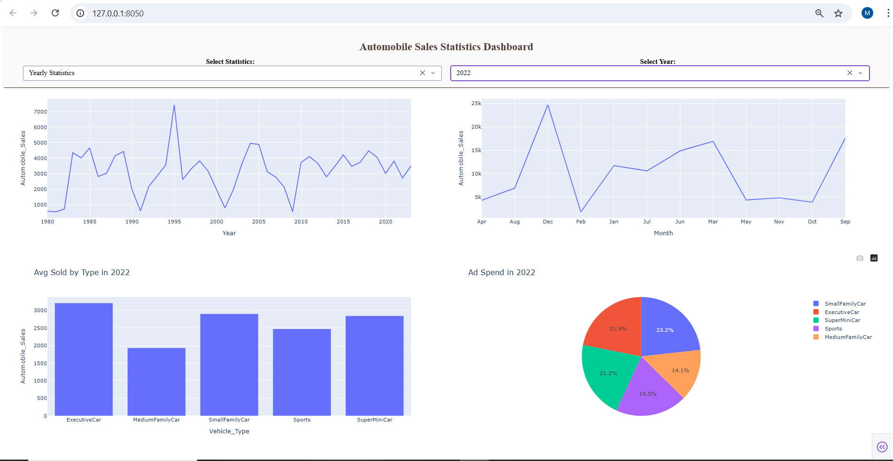
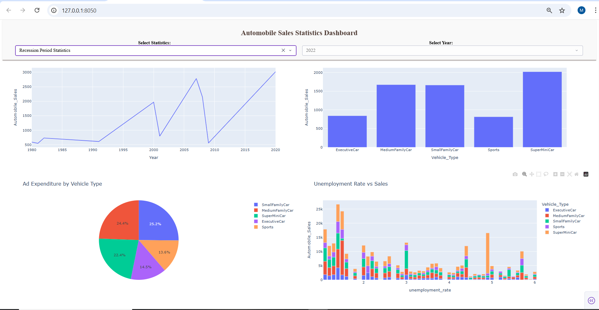

# Automobile Sales Statistics Dashboard 🚗📊

An interactive web-based dashboard built with **Python**, **Dash**, and **Plotly** to analyze historical automobile sales data (1980-2023). The project focuses on visualizing sales trends during both normal and economic recession periods.

## 🌟 Features
- **Yearly Statistics:** Detailed insights into annual sales, monthly trends, and vehicle type performance.
- **Recession Analysis:** Specialized reporting on how economic downturns impact sales, advertising spend, and unemployment correlation.
- **Interactive UI:** Dynamic dropdowns and responsive 2x2 grid layout.
- **Sticky Header:** Enhanced navigation for a better user experience.

## 🛠️ Tech Stack
- **Backend:** Python (Dash)
- **Visualization:** Plotly Express
- **Data Handling:** Pandas

## 📁 Project Structure

├── app.py              # Main Dash application code
├── automobile_sales.csv  # Dataset
├── requirements.txt    # Project dependencies
├── README.md           # Documentation
└── assets/             # Images and screenshots

## 🚀 How to Run
## Clone the repository:
   
   git clone [https://github.com/MohamedAshraf2710/Economic-Recession-Impact-on-Automobile-Sales.git]

## Install dependencies:

pip install -r requirements.txt

## Run the app:

python app.py

---

## 📸 Dashboard Preview

---

## 👤 Author
**Mohamed Ashraf**
*AI Engineer | Backend Developer*
LinkedIn:https://www.linkedin.com/in/mohamed-ashraf-shaaban/   